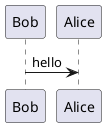

# DevOpsGitlab
Concentrating Devops knowledge with Gitlab Ci / CD targeting mainly Go projects.

## Start
Change to `compose` folder and run:
```
docker-compose up -d
```
List Docker containers
```
docker ps --format "table {{.ID}}\t{{.Status}}\t{{.Names}}"
```
Connect to the container running the Gitlab runner
```
docker exec -it <container ID> /bin/bash
```
## Add Runner
### Register the runner 
As per Admin Area / Overview / Runners / Show Runner installation instructions. Token as per run.
```
sudo gitlab-runner register --url http://172.30.0.5/ --registration-token fvxNvA9N2WSkHn6bv4ys
```
### Configure runner network
In `/etc/gitlab-runner/config.toml` add the Docker Compose created network:
```
[runners.docker]
   network_mode= "gitlab"
```
### Restart runner container
```
docker restart <container ID>
```
### Example
```
concurrent = 1
check_interval = 0

[session_server]
  session_timeout = 1800

[[runners]]
  name = "f8dfb8769f23"
  url = "http://172.30.0.5/"
  token = "RdmPzTQzj1dmA-Ai1LgS"
  executor = "docker"
  [runners.custom_build_dir]
  [runners.cache]
    [runners.cache.s3]
    [runners.cache.gcs]
    [runners.cache.azure]
  [runners.docker]
    tls_verify = false
    image = "golang:latest"
    privileged = false
    disable_entrypoint_overwrite = false
    oom_kill_disable = false
    disable_cache = false
    volumes = ["/cache"]
    shm_size = 0
    network_mode = "gitlab"
```

### Resources
```
https://serverfault.com/a/1020417
https://docs.gitlab.com/runner/register/#one-line-registration-command
```

## Add PlantUML
In `/etc/gitlab/gitlab.rb` add below and run `gitlab-ctl reconfigure`:
```
nginx['custom_gitlab_server_config'] = "location /-/plantuml/ { \n    proxy_cache off; \n    proxy_pass  http://192.168.1.9:8080/; \n}\n"
gitlab_rails['env'] = { 'PLANTUML_ENCODING' => 'deflate' }
```
Verify PlantUML is working on HTTP at ex. `http://localhost:8080`.<br/>
Configure this link in Gitlab Admin Area / Settings / Gemeral / PlantUML.<br/>
In case it does not work the idea is to verify the image URL in Gitlab and tune it to have a PlantUML render.

### Add the drawing


### Resources
```
https://docs.gitlab.com/ee/administration/integration/plantuml.html#configure-your-plantuml-server
https://www.youtube.com/watch?v=V4dHQWRoeM0
```

